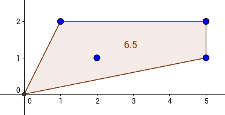

## Description
------
As a young naturalist, you've been studying the inhabitants of the nearby woods for the past several months. You've just come across some footprints you've never seen before. To learn more about the habitat of the animal that left them, you marked the footprints locations on your map.

The information about the places where the animal left its footprints is stored in the table **places**. Here is its structure:

* **x**: The <code>x</code>-coordinate of the place;
* **y**: The <code>y</code>-coordinate of the place.

It is guaranteed that pairs <code>(x, y)</code> are unique.

Now you want to find the area of the animal's habitat. You decided that the convex hull of the marked points is a good first approximation of the habitat, so you want to find the area of this hull.

Given the **places** table, return a table that has only one column <code>area</code> and consists of a single row: the area of the convex hull. It is guaranteed that the resulting area is greater than <code>0</code>.

**Example**

For the following table **places**

| x | y |
| -- | -- |
|0	|0|
|1	|2|
|2	|1|
|5	|1|
|5	|2|

the output should be

| area |
| -- |
| 6.5	|

Here is an illustration of the given points and their convex hull:

Note that you should return the exact answer without any trailing zeros.

* **[execution time limit] 10 seconds (mysql)**

## Solution
------







