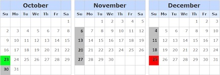

## Description

---

You are developing an alarm clock app that works as follows: the user can set a date and a time, and the app will ring every week at the given time starting at the given date until the end of the current year.

The starting date is the only record in the **userInput** table of the following structure:

- **input_date**: the date and time of the first alarm (of a <code>DATETIME</code> type).

Given the table, your task is to compose the resulting table with a single column <code>alarm_date</code>. This column should contain all dates (including time) when the alarm clock will ring in ascending order.

**Example**

For the following table **userInput**

| input_date          |
| ------------------- |
| 2016-10-23 22:00:00 |

the output should be

| alarm_date          |
| ------------------- |
| 2016-10-23 22:00:00 |
| 2016-10-30 22:00:00 |
| 2016-11-06 22:00:00 |
| 2016-11-13 22:00:00 |
| 2016-11-20 22:00:00 |
| 2016-11-27 22:00:00 |
| 2016-12-04 22:00:00 |
| 2016-12-11 22:00:00 |
| 2016-12-18 22:00:00 |
| 2016-12-25 22:00:00 |

- **[execution time limit] 10 seconds (mysql)**

## Solution

---







