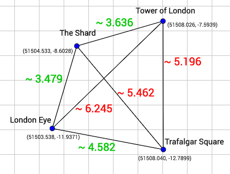

## Description

---

You're going on vacation in a big city, and you've prepared a list of all the sights you'd like to visit. As you don't have much time and can't spend a whole day at one interesting place, you want to visit several sights per day and walk from one site to another. But walking a long distance might be boring, so you won't walk between two places if the distance between them is <code>5</code> km or more.

To find the route that you should take, you are going to find all pairs of places that are less than <code>5</code> km from each other.

The places of interests are stored in a table **sights**, which has the following attributes:

- **id**: the unique ID of the place;
- **name**: the name of the place;
- **x**: the x coordinate of the place;
- **y**: the y coordinate of the place.

The distance between the places is calculated with the assumption that they are just points on a 2D map.

Given the **sights** table, find all pairs of places that are less than <code>5</code> km from each other and return them as a table with the columns <code>place1</code> and <code>place2</code>. Sort them in lexicographical order. The places in the pairs should also be sorted lexicographically.

_Note: Array A is lexicographically smaller than array B either if A is a prefix of B (and A ≠ B), or if there exists such index i (0 ≤ i < min(A.length, B.length)), that Ai < Bi, and for any j (0 ≤ j < i) Aj = Bj._

_Note 2: String A is lexicographically smaller than string B either if A is a prefix of B (and A ≠ B), or if there exists such index i (0 ≤ i < min(A.length, B.length)), that Ai < Bi, and for any j (0 ≤ j < i) Aj = Bj. The lexicographic comparison of strings is implemented by operator < in modern programming languages._

**Example**

For the following table **sights**

| id  | name             | x         | y        |
| --- | ---------------- | --------- | -------- |
| 1   | Tower of London  | 51508.026 | -7.5939  |
| 2   | Trafalgar Square | 51508.040 | -12.7899 |
| 3   | London Eye       | 51503.538 | -11.9371 |
| 4   | The Shard        | 51504.533 | -8.6028  |

the output should be

| place1     | place2           |
| ---------- | ---------------- |
| London Eye | The Shard        |
| London Eye | Trafalgar Square |
| The Shard  | Tower of London  |

- **[execution time limit] 10 seconds (mysql)**

## Solution

---







