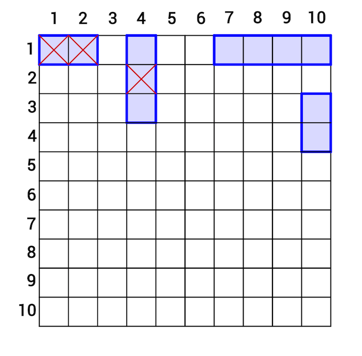

## Description
------

In the 2-player game Battleship, each player takes turns guessing the position of the other player's battleships on a <code>10 x 10</code> playing board. When a player correctly guesses a grid that contains a segment of an opponent's battleship, the ship is damaged. If all the segments of a ship have been damaged, the ship is declared to be sunk. You're evaluating an ongoing Battleship game, and have two tables.

The table **locations_of_ships** contains the locations of one of the player's ships. This table contains the following columns:

* **id** - the unique ID of the ship;
* **upper_left_x** - the <code>x</code>-coordinate of the upper left corner;
* **upper_left_y** - the <code>y</code>-coordinate of the upper left corner;
* **bottom_right_x** - the <code>x</code>-coordinate of the bottom right corner;
* **bottom_right_y** - the <code>y</code>-coordinate of the bottom right corner.

In this task there can be these types of ships - <code>1 × 1, 1 × 2, 1 × 3, 1 × 4, 2 × 1, 3 × 1, 4 × 1</code> , number of ships of particular type is not fixed, but it is guaranteed that they don't overlap.

The target squares of the opponent's shots are given in another table, **opponents_shots**, which has the following columns:

* **id** - the unique ID of the shot;
* **target_x** - the x-coordinate of the target square;
* **target_y** - the y-coordinate of the target square.

All the coordinates in these tables are <code>1</code>-based.

The goal is to return a table that describes the current state of the game. For each class of ship (i.e. for each different size), there should be a row containing four integers: a ship's size in the column <code>size</code>, the number of <code>undamaged</code> ships of that type in the column undamaged, the number of partly damaged ships of that size in the column <code>partly_damaged</code>, and the number of ships of that type that have already been sunk in the column <code>sunk</code>. The result should be ordered by the size of the ships.

**Example**

For the following tables **locations_of_ships**

| id  | upper_left_x | upper_left_y | bottom_right_x | bottom_right_y |
| --- | ------------ | ------------ | -------------- | -------------- |
| 1   | 1            | 1            | 2              | 1              |
| 2   | 4            | 1            | 4              | 3              |
| 3   | 7            | 1            | 10             | 1              |
| 4   | 10           | 3            | 10             | 4              |

and table **opponents_shots**

| id  | target_x | target_y |
| --- | -------- | -------- |
| 1   | 1        | 1        |
| 2   | 2        | 1        |
| 3   | 4        | 2        |

the output should be

| size | undamaged | partly_damaged | sunk |
| ---- | --------- | -------------- | ---- |
| 2    | 1         | 0              | 1    |
| 3    | 0         | 1              | 0    |
| 4    | 1         | 0              | 0    |

The diagram below shows the state of the game board:

* **[execution time limit] 10 seconds (mysql)**

## Solution
------







