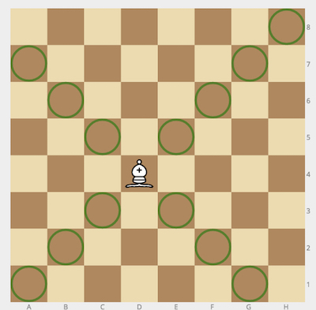
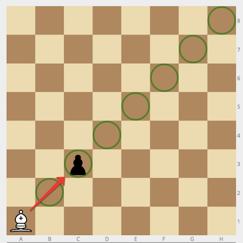
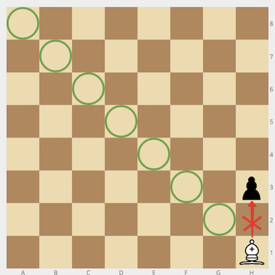

## Description
------

Given the positions of a white <code>bishop</code> and a black <code>pawn</code> on the standard chess board, determine whether the bishop can capture the pawn in one move.

The bishop has no restrictions in distance for each move, but is limited to diagonal movement. Check out the example below to see how it can move:

**Example**

* For <code>bishop = "a1"</code> and <code>pawn = "c3"</code>, the output should be
<code>bishopAndPawn(bishop, pawn) = true</code>.

* For <code>bishop = "h1"</code> and <code>pawn = "h3"</code>, the output should be
<code>bishopAndPawn(bishop, pawn) = false</code>.

**Input/Output**

* **[execution time limit] 4 seconds (js)**

* **[input] string bishop**

Coordinates of the white bishop in the chess notation.

*Note*: __Chess Notation__ - Each square of the chessboard is identified by a unique coordinate pair—a letter and a number. The vertical columns of squares from white's left to the right are labeled <code>'a'</code> through <code>'h'</code>. The horizontal rows of squares are numbered <code>1</code> to <code>8</code> starting from white's side of the board. Thus each square has a unique identification as a string consisting of two characters: the first is the column label, and the second in the row number.

* **[input] string pawn**

Coordinates of the black pawn in the same notation.

* **[output] boolean**

<code>true</code> if the bishop can capture the pawn, <code>false</code> otherwise.

**[JavaScript (ES6)] Syntax Tips**


// Prints help message to the console
// Returns a string
function helloWorld(name) {
    console.log("This prints to the console when you Run Tests");
    return "Hello, " + name;
}


## Solution
------







