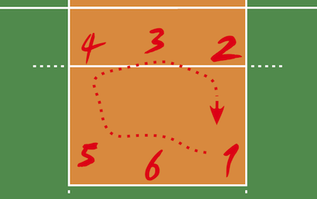

## Description

---

You are watching a volleyball tournament, but you missed the beginning of the very first game of your favorite team. Now you're curious about how the coach arranged the players on the field at the start of the game.

The team you favor plays in the following formation:

<code type='preformat'>
0 3 0
4 0 2
0 6 0
5 0 1
</code>

where positive numbers represent positions occupied by players. After the team gains the serve, its members rotate one position in a clockwise direction, so the player in position <code>2</code> moves to position <code>1</code>, the player in position <code>3</code> moves to position <code>2</code>, and so on, with the player in position <code>1</code> moving to position <code>6</code>.

Here's how the players change their positions:

Given the current <code>formation</code> of the team and the number of times <code>k</code> it gained the serve, find the initial position of each player in it.

**Example**

- For
  <code type='preformat'>
  formation = [["empty", "Player5", "empty"],
  ["Player4", "empty", "Player2"],
  ["empty", "Player3", "empty"],
  ["Player6", "empty", "Player1"]]
  </code>

  and <code>k = 2</code>, the output should be

  <code type='preformat'>
  volleyballPositions(formation, k) = [
  ["empty", "Player1", "empty"],
  ["Player2", "empty", "Player3"],
  ["empty", "Player4", "empty"],
  ["Player5", "empty", "Player6"]
  ]
  </code>

- For
  <code type='preformat'>
  formation = [["empty", "Alice", "empty"],
  ["Bob", "empty", "Charlie"],
  ["empty", "Dave", "empty"],
  ["Eve", "empty", "Frank"]]
  </code>

  and <code>k = 6</code>, the output should be

  <code type='preformat'>
  volleyballPositions(formation, k) = [
      ["empty", "Alice", "empty"],
      ["Bob",   "empty", "Charlie"],
      ["empty", "Dave",  "empty"],
      ["Eve",   "empty", "Frank"]
  ]
  </code>

**Input/Output**

- **[execution time limit] 4 seconds (js)**

- **[input] array.array.string formation**

  Array of strings representing names of the players in the positions corresponding to those in the schema above. 
  It is guaranteed that for each empty position the corresponding element of <code>formation</code> is <code>"empty"</code>. 
  It is also guaranteed that there is no player called <code>"empty"</code> in the team. 

  _Guaranteed constraints:_ 
  <code>formation.length = 4</code>,  <code>formation[i].length = 3</code>.

- **[input] integer k**

  The number of times the team gained the serve. 

  _Guaranteed constraints:_ 
  <code>0 ≤ k ≤ 109</code>.

* **[output] array.array.string**
  - Team arrangement at the start of the game.

**[JavaScript (ES6)] Syntax Tips**


// Prints help message to the console
// Returns a string
function helloWorld(name) {
console.log("This prints to the console when you Run Tests");
return "Hello, " + name;
}


## Solution

---







