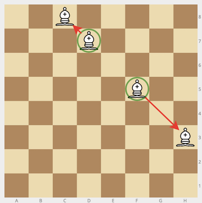
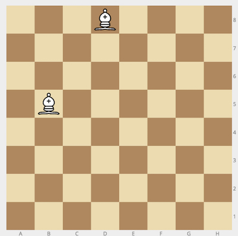

## Description

---

In the Land Of Chess, bishops don't really like each other. In fact, when two bishops happen to stand on the same _diagonal_, they immediately rush towards the opposite ends of that same diagonal.

Given the initial positions (in chess notation) of two bishops, <code>bishop1</code> and <code>bishop2</code>, calculate their future positions. Keep in mind that bishops won't move unless they see each other along the same diagonal.

**Example**

- For <code>bishop1 = "d7"</code> and <code>bishop2 = "f5",</code> the output should be
  <code>bishopDiagonal(bishop1, bishop2) = ["c8", "h3"]</code>.

  

- For <code>bishop1 = "d8"</code> and <code>bishop2 = "b5"</code>, the output should be
  <code>bishopDiagonal(bishop1, bishop2) = ["b5", "d8"]</code>.

  The bishops don't belong to the same diagonal, so they don't move.

  

**Input/Output**

- **[execution time limit] 4 seconds (js)**

- **[input] string bishop1**

  Coordinates of the first bishop in chess notation. 

  _Guaranteed constraints:_ 
  <code>bishop1.length = 2</code>, 
  <code>'a' ≤ bishop1[0] ≤ 'h'</code>, 
  <code>1 ≤ bishop1[1] ≤ 8</code>.

  Note (Chess notation): Each square of the chessboard is identified by a unique coordinate pair—a letter and a number. The vertical columns of squares from white's left to the right are labeled 'a' through 'h'. The horizontal rows of squares are numbered 1 to 8 starting from white's side of the board. Thus each square has a unique identification as a string consisting of two characters: the first is the column label, and the second in the row number.

  

- **[input] string bishop1**

  Coordinates of the first bishop in chess notation. 

  _Guaranteed constraints:_ 
  <code>bishop2.length = 2</code>, 
  <code>'a' ≤ bishop2[0] ≤ 'h'</code>, 
  <code>1 ≤ bishop2[1] ≤ 8</code>.

* **[output] array.string**

  - Coordinates of the bishops in lexicographical order after they check the diagonals they stand on.

  Note (lexicographical order): A way of sorting strings, similar to alphabetical order but generalized to all kinds of characters.

  When comparing two strings, <code>s</code> and <code>t</code>, we compare each pair of characters with equal indices (<code>s[i]</code> and <code>t[i]</code>), starting with <code>i = 0</code>:

  - if <code>s[i]</code> < <code>t[i]</code> or if <code>s[i]</code> is undefined, then we conclude that <code>s</code> < <code>t</code>,
  - if <code>s[i]</code> > <code>t[i]</code> or if <code>t[i]</code> is undefined, then we conclude that <code>s</code> > <code>t</code>,
  - if <code>s[i]</code> = <code>t[i]</code> then we repeat the process by comparing <code>s[i </code>+ 1] to <code>t[i </code>+ 1].

  If the two strings have equal length and <code>s[i]</code> = <code>t[i]</code> for every character, then we conclude that <code>s</code> = <code>t</code>

  Examples:

  - <code>"snow" > "snoring"</code> because the first string contains a greater character at index <code>i = 2</code>
  - <code>"cat" < "caterpillar"</code> because the first string is undefined at index <code>i = 3</code>

**[JavaScript (ES6)] Syntax Tips**


// Prints help message to the console
// Returns a string
function helloWorld(name) {
console.log("This prints to the console when you Run Tests");
return "Hello, " + name;
}


## Solution

---







