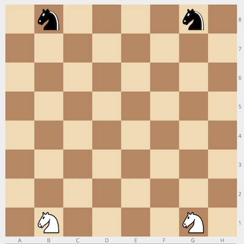
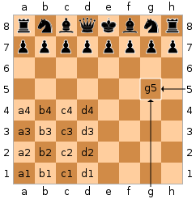

## Description

---

Imagine a standard chess board with only two white and two black knights placed in their standard starting positions: the white knights on <code>b1</code> and <code>g1</code>; the black knights on <code>b8</code> and <code>g8</code>.

There are two players: one plays for white, the other for black. During each move, the player picks one of his knights and moves it to an unoccupied square according to standard chess rules. Thus, a knight on <code>d5</code> can move to any of the following squares: <code>b6</code>, <code>c7</code>, <code>e7</code>, <code>f6</code>, <code>f4</code>, <code>e3</code>, <code>c3</code>, and <code>b4</code>, as long as it is not occupied by either a friendly or an enemy knight.

The players take turns in making moves, starting with the white player. Given the configuration <code>p</code> of the knights after an unspecified number of moves, determine whose turn it is.

**Example**

For <code>p = "b1;g1;b8;g8"</code>, the output should be
<code>whoseTurn(p) = true</code>.

The configuration corresponds to the initial state of the game. Thus, it's white's turn.

**Input/Output**

- **[execution time limit] 4 seconds (js)**

- **[input] string p**

  The positions of the four knights, starting with white knights, separated by a semicolon, in the chess notation. 

  _Guaranteed constraints:_ 
  <code>p.length = 11</code>.

  Note (Chess notation): Each square of the chessboard is identified by a unique coordinate pair—a letter and a number. The vertical columns of squares from white's left to the right are labeled 'a' through 'h'. The horizontal rows of squares are numbered 1 to 8 starting from white's side of the board. Thus each square has a unique identification as a string consisting of two characters: the first is the column label, and the second in the row number.

  

* **[output] boolean**

  - <code>true</code> if white is to move, <code>false</code> otherwise.

**[JavaScript (ES6)] Syntax Tips**


// Prints help message to the console
// Returns a string
function helloWorld(name) {
console.log("This prints to the console when you Run Tests");
return "Hello, " + name;
}


## Solution

---







