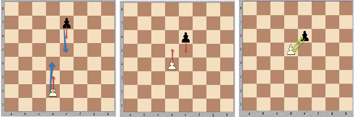

## Description

---

_Pawn_ race is a game for two people, played on an ordinary <code>8 × 8</code> chessboard. The first player has a white pawn, the second one - a black pawn. Initially the pawns are placed somewhere on the board so that the <code>1st</code> and the <code>8th</code> rows are not occupied. Players take turns to make a move.

White pawn moves upwards, black one moves downwards. The following moves are allowed:

- one-cell move on the same vertical in the allowed direction;
- two-cell move on the same vertical in the allowed direction, if the pawn is standing on the <code>2nd</code> (for the white pawn) or the <code>7th</code> (for the black pawn) row. Note that even with the two-cell move a pawn can't jump over the opponent's pawn;
- capture move one cell forward in the allowed direction and one cell to the left or to the right.

The purpose of the game is to reach the the <code>1st</code> row (for the black pawn) or the <code>8th</code> row (for the white one), or to capture the opponent's pawn.

Given the initial positions and whose turn it is, determine who will win or declare it a draw (i.e. it is impossible for any player to win). Assume that the players play optimally.

**Example**

- For <code>white = "e2"</code>, <code>black = "e7"</code>, and <code>toMove = 'w'</code>, the output should be
  <code>pawnRace(white, black, toMove) = "draw"</code>;
- For <code>white = "e3"</code>, <code>black = "d7"</code>, and <code>toMove = 'b'</code>, the output should be
  <code>pawnRace(white, black, toMove) = "black"</code>;
- For <code>white = "a7"</code>, <code>black = "h2"</code>, and <code>toMove = 'w'</code>, the output should be
  <code>pawnRace(white, black, toMove) = "white"</code>.

**Input/Output**

- **[execution time limit] 4 seconds (js)**
- **[input] string white**

  Coordinates of the white pawn in the chess notation. 

  Note (Chess notation): Each square of the chessboard is identified by a unique coordinate pair—a letter and a number. The vertical columns of squares from white's left to the right are labeled 'a' through 'h'. The horizontal rows of squares are numbered 1 to 8 starting from white's side of the board. Thus each square has a unique identification as a string consisting of two characters: the first is the column label, and the second in the row number.

  

- **[input] string black**
  Position of the black pawn in the same notation. It is guaranteed that <code>white ≠ black</code>. 

- **[input] char toMove**
  <code>'w'</code> if it is the first player's turn, <code>'b'</code> otherwise. 

* **[output] string**
  - <code>"white"</code>, <code>"black"</code> or <code>"draw"</code> depending on the result of the game.

**[JavaScript (ES6)] Syntax Tips**


// Prints help message to the console
// Returns a string
function helloWorld(name) {
console.log("This prints to the console when you Run Tests");
return "Hello, " + name;
}


## Solution

---







