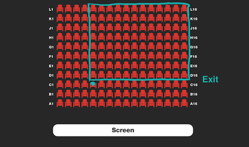

## Description
------

Your friend advised you to see a new performance in the most popular theater in the city. He knows a lot about art and his advice is usually good, but not this time: the performance turned out to be awfully dull. It's so bad you want to sneak out, which is quite simple, especially since the exit is located right behind your row to the left. All you need to do is climb over your seat and make your way to the exit.

The main problem is your shyness: you're afraid that you'll end up blocking the view (even if only for a couple of seconds) of all the people who sit behind you and in your column or the columns to your left. To gain some courage, you decide to calculate the number of such people and see if you can possibly make it to the exit without disturbing too many people.

Given the total number of rows and columns in the theater (<code>nRows</code> and <code>nCols</code>, respectively), and the <code>row</code> and <code>column</code> you're sitting in, return the number of people who sit strictly behind you **and** in your column or to the left, assuming all seats are occupied.

**Example**

For <code>nCols = 16</code>, <code>nRows = 11</code>, <code>col = 5</code>, and <code>row = 3</code>, the output should be
<code>seatsInTheater(nCols, nRows, col, row) = 96</code>.

Here is what the theater looks like:

**Input/Output**

* **[execution time limit] 4 seconds (js)**

* **[input] integer nCols**

    An integer, the number of theater's columns.

    _Guaranteed constraints:_ 
    <code type='math/tex'>1 \leq nCols \leq 1000</code>.

* **[input] integer nRows**

    An integer, the number of theater's rows.

    _Guaranteed constraints:_ 
    <code type='math/tex'>1 \leq nRows \leq 1000</code>.

* **[input] integer col**

    An integer, the column number of your own seat (1-based).

    _Guaranteed constraints:_ 
<code type='math/tex'>1 \leq col \leq nCols</code>.

* **[input] integer row**

    An integer, the row number of your own seat (1-based).

    _Guaranteed constraints:_ 
    <code type='math/tex'>1 \leq row \leq nRows</code>.

* **[output] integer**

    * The number of people who sit strictly behind you **and** in your column or to the left.

**[JavaScript (ES6)] Syntax Tips**


// Prints help message to the console
// Returns a string
function helloWorld(name) {
    console.log("This prints to the console when you Run Tests");
    return "Hello, " + name;
}


## Solution
------







