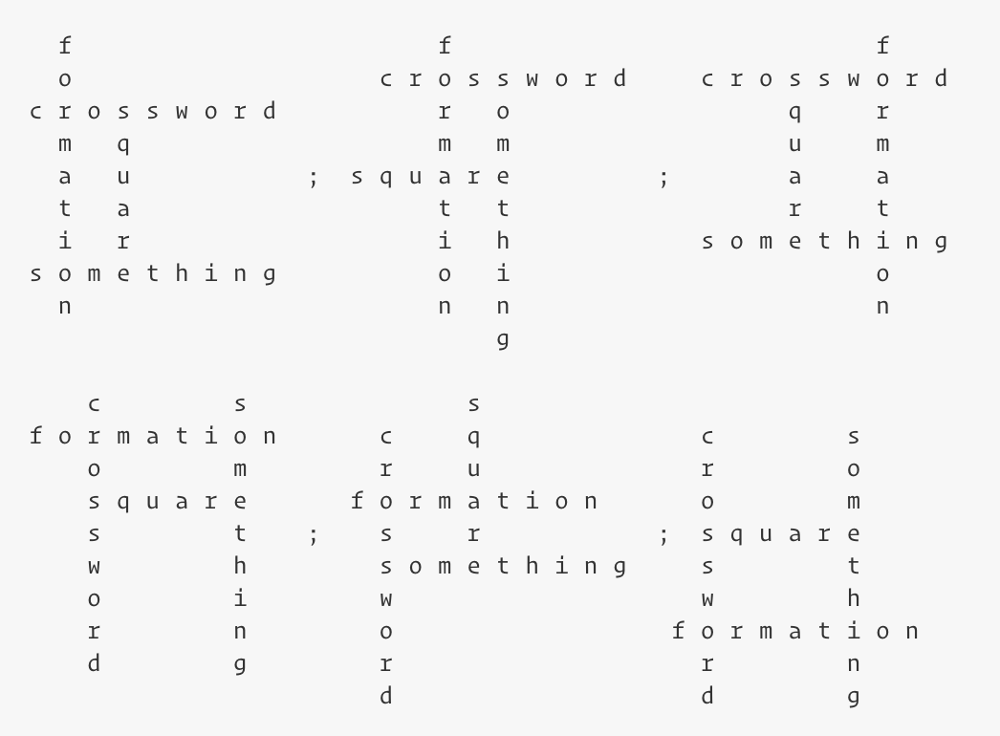

## Description

---

You're a crossword fanatic, and have finally decided to try and create your own. However, you also love symmetry and good design, so you come up with a set of rules they should follow:

- the crossword must contain exactly four words;
- these four words should form four pairwise intersections;
- all words must be written either left-to-right or top-to-bottom;
- the area of the rectangle formed by empty cells inside the intersections isn't equal to zero.

Given <code>4</code> words, find the number of ways to make a crossword following the above-described rules. Note that two crosswords which differ by rotation are considered different.

**Example**

For <code>words = ["crossword", "square", "formation", "something"]</code>, the output should be
<code>crosswordFormation(words) = 6</code>.

The six crosswords can be formed as shown below:

**Input/Output**

- **[execution time limit] 4 seconds (js)**

- **[input] integer array.string words**

  An array of distinct strings, the words you need to use in your crossword. 

  _Guaranteed constraints:_ 
   <code>words.length = 4</code>,
   <code>3 ≤ words[i].length < 15</code>.

- **[output] integer**
  - The number of ways to make a correct crossword of the desired formation.

**[JavaScript (ES6)] Syntax Tips**


// Prints help message to the console
// Returns a string
function helloWorld(name) {
console.log("This prints to the console when you Run Tests");
return "Hello, " + name;
}


## Solution

---







