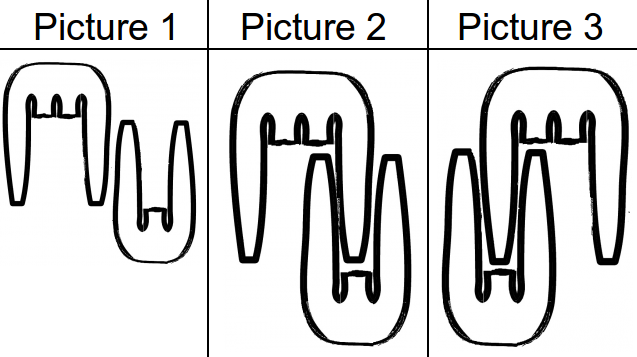

## Description

---

Miss X has only two combs in her possession, both of which are old and miss a tooth or two. She also has many purses of different length, in which she carries the combs. The only way they fit is horizontally and without overlapping. Given teeth' positions on both combs, find the minimum length of the purse she needs to take them with her.

It is guaranteed that there is at least one tooth at each end of the comb. 
It is also guaranteed that the total length of two strings is smaller than <code>32</code>. 
Note, that the combs can **not** be rotated/reversed.

**Example**

For <code>comb1 = "_.._"</code> and <code>comb2 = "_._"</code>, the output should be
<code>combs(comb1, comb2) = 5</code>.

Although it is possible to place the combs like on the first picture, the best way to do this is either picture 2 or picture 3.

**Input/Output**

- **[execution time limit] 4 seconds (js)**

- **[input] string comb1**

  A comb is represented as a string. If there is an asterisk (<code>'\*'</code>) in the <code>ith</code> position, there is a tooth there. Otherwise there is a dot (<code>'.'</code>), which means there is a missing tooth on the comb. 

  _Guaranteed constraints:_ 
  <code>3 ≤ comb1.length ≤ 8</code>.

- **[input] string comb2**

  The second comb is represented in the same way as the first one. 

  _Guaranteed constraints:_ 
  <code>1 ≤ comb2.length ≤ 5</code>.

* **[output] integer**
  - The minimum length of a purse Miss X needs.

**[JavaScript (ES6)] Syntax Tips**


// Prints help message to the console
// Returns a string
function helloWorld(name) {
console.log("This prints to the console when you Run Tests");
return "Hello, " + name;
}


## Solution

---







